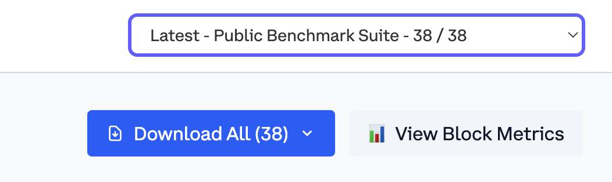

# Base Benchmark

Base Benchmark is a performance testing framework for Ethereum execution clients. Compare client performance, identify bottlenecks, and ensure reliability before deployment.

<!-- Badge row 1 - status -->

[](https://github.com/base/benchmark/graphs/contributors)
[](https://github.com/base/benchmark/graphs/contributors)
[](https://github.com/base/benchmark/stargazers)

[](https://github.com/base/benchmark/blob/main/LICENSE)

<!-- Badge row 2 - links and profiles -->

[](https://base.org)
[](https://base.mirror.xyz/)
[](https://docs.base.org/)
[](https://base.org/discord)
[](https://twitter.com/Base)

<!-- Badge row 3 - detailed status -->

[](https://github.com/base/benchmark/pulls)
[](https://github.com/base/benchmark/issues)

## Results

Public results are available at the following links:

| Network      | Link                                                                   |
| ------------ | ---------------------------------------------------------------------- |
| Devnet       | [https://base.github.io/benchmark/](https://base.github.io/benchmark/) |
| Base Sepolia | Coming soon                                                            |
| Base Mainnet | Coming soon                                                            |

## Features

- **Performance Evaluation:** Test both block building and validation performance across execution clients (Geth, Reth, and more)
- **Comparative Analysis:** Measure client behavior across various inputs and workloads
- **Metric Collection:** Track critical metrics including submission times, latency, and throughput
- **Flexible Workloads:** Configure transaction patterns to match your specific needs
- **Interactive Dashboard:** Generate beautiful HTML reports with charts and run comparisons
- **Import & Merge:** Combine benchmark results from multiple machines with flexible tagging

## Repository Structure

```
.
├── Makefile              # Build and development tasks
├── go.mod                # Go module dependencies
├── benchmark/            # CLI application
│   ├── cmd/              # Main entry point
│   ├── config/           # Configuration types
│   └── flags/            # CLI flags
├── runner/               # Core benchmarking logic
│   ├── benchmark/        # Benchmark execution
│   ├── clients/          # Client integrations (Geth, Reth)
│   ├── importer/         # Run import functionality
│   ├── network/          # Network setup and management
│   └── payload/          # Transaction payload generation
├── configs/              # Benchmark configurations
│   ├── examples/         # Development and testing configs
│   └── public/           # Production-ready benchmarks
├── contracts/            # Smart contracts for testing
│   └── src/              # Solidity source files
├── report/               # Interactive dashboard
│   └── src/              # React TypeScript application
└── clients/              # Client build scripts
```

## Prerequisites

- **Go:** Version 1.21 or later. Install from [go.dev](https://go.dev/dl/)
- **Foundry:** For smart contract compilation. See [installation guide](https://book.getfoundry.sh/getting-started/installation)
- **Node.js:** Version 18+ for the interactive dashboard. Install from [nodejs.org](https://nodejs.org/)

## Getting Started

### 1. Clone the Repository

```bash
git clone https://github.com/base/benchmark.git
cd benchmark
git submodule update --init --recursive
```

### 2. Build the Application

```bash
make build
```

The binary will be located at `bin/benchmark`.

### 3. Build Client Binaries (Optional)

To build Geth and Reth from source:

```bash
make build-binaries
```

Alternatively, you can specify paths to pre-built binaries when running benchmarks.

### 4. Run Your First Benchmark

```bash
./bin/base-bench run \
  --config ./configs/public/basic.yml \
  --root-dir ./data-dir \
  --output-dir ./output
```

To see available options:

```bash
./bin/base-bench run --help
```

### 5. View Results in the Interactive Dashboard

```bash
cd report/
npm install
npm run dev
```

Open your browser to the URL shown (typically `http://localhost:5173`).

## Available Benchmarks

Explore the comprehensive collection of benchmark configurations:

**[📁 Configuration Guide](configs/README.md)** - Detailed documentation of all available benchmark configurations

- **[examples/](configs/examples/)** - Development and testing configurations for specific workloads
- **[public/](configs/public/)** - Production-ready benchmarks for standardized testing

Choose from storage operations, precompile tests, token workloads, mainnet simulations, and more.

## Tools

### Payload Simulator

The **[Payload Simulator](runner/payload/simulator/README.md)** analyzes real-world block execution characteristics by fetching blocks from live chains and computing statistics about:

- Account and storage operations (reads, writes, creates, deletes)
- Opcode usage patterns (EXP, KECCAK256, etc.)
- Precompile calls (ecrecover, bn256, BLS12-381, etc.)

Use it to generate realistic benchmark configurations based on actual mainnet data:

```bash
go build -o bin/payload-simulator ./runner/payload/simulator/cmd

# RPC must support debug_executionWitness
./bin/payload-simulator \
  --rpc-url <your-rpc-url> \
  --sample-size 100
```

## Architecture

### Benchmark Structure

Each benchmark consists of configurable tests with various input parameters:

```yaml
payloads:
  - name: Transfer only
    id: transfer-only
    type: transfer-only

benchmarks:
  - name: Test Performance
    description: Execution Speed
    variables:
      - type: payload
        value: transfer-only
      - type: node_type
        values:
          - reth
          - geth
      - type: num_blocks
        value: 20
```

This configuration runs a `transfer-only` transaction payload against both Geth and Reth clients for 20 blocks.

### Test Methodology

Each test executes a standardized workflow:

1. Initialize a sequencer/block builder with specified gas limits
2. Generate transactions and submit to the sequencer mempool
3. Record all payloads via `engine_forkChoiceUpdated` and `engine_getPayload`
4. Set up the validator node
5. Process payloads through `engine_newPayload`

This approach allows precise measurement of performance characteristics for both block production and validation.

## Configuration

### Available Flags

```
NAME:
   benchmark run - run benchmark

USAGE:
   benchmark run [command options]

OPTIONS:
   --config value                  Config Path ($BASE_BENCH_CONFIG)
   --root-dir value                Root Directory ($BASE_BENCH_ROOT_DIR)
   --output-dir value              Output Directory ($BASE_BENCH_OUTPUT_DIR)
   --tx-fuzz-bin value             Transaction Fuzzer path (default: "../tx-fuzz/cmd/livefuzzer/livefuzzer")

   # Reth Configuration
   --reth-bin value                Reth binary path (default: "reth")
   --reth-http-port value          HTTP port (default: 9545)
   --reth-auth-rpc-port value      Auth RPC port (default: 9551)
   --reth-metrics-port value       Metrics port (default: 9080)

   # Geth Configuration
   --geth-bin value                Geth binary path (default: "geth")
   --geth-http-port value          HTTP port (default: 8545)
   --geth-auth-rpc-port value      Auth RPC port (default: 8551)
   --geth-metrics-port value       Metrics port (default: 8080)

   # General Options
   --proxy-port value              Proxy port (default: 8546)
   --help, -h                      Show help (default: false)
```

## Managing Test Runs

### Understanding Runs and Suites

When you view benchmark results in the interactive dashboard, you can switch between different test runs using the run switcher:

<div align="center">
  
</div>

### Creating Test Runs

Running benchmarks adds a new suite by default:

```bash
./bin/base-bench run --config ./configs/public/basic.yml
```

Each execution creates a new suite entry in the run list, allowing you to track performance over time or across different configurations.

### Combining Multiple Runs

Use `import-runs` to merge benchmark results from multiple machines or configurations:

```bash
./bin/base-bench import-runs \
  --output-dir ./output \
  ./results-from-server-1/metadata.json
```

**Two import strategies:**

1. **Add to latest suite with tags** - Merge imported runs into your most recent suite, using tags to differentiate:

   ```bash
   # Add imported runs to the last suite with tags for differentiation
   ./bin/base-bench import-runs \
     --src-tag "instance=server-lg" \
     --dest-tag "instance=server-md" \
     --output-dir ./output \
     ./results-from-server-1/metadata.json

   # --src-tag fills missing tags on existing runs (won't overwrite)
   # --dest-tag applies to the imported runs
   # Useful for comparing hardware configurations within the same test run
   ```

2. **Create new separate suite** - Add imported runs as an independent suite in the list:

   ```bash
   # Interactive mode (recommended) - prompts you to choose strategy and configure tags
   ./bin/base-bench import-runs \
     --output-dir ./output \
     ./results-from-server-1/metadata.json

   # Creates a new entry differentiated by BenchmarkRun ID
   # Useful for tracking performance across different code versions or time periods
   ```

**Interactive Mode:** Without specifying tags, the tool enters interactive mode and guides you through:

- Choosing between adding to last suite or creating new suite
- Configuring appropriate tags if needed
- Confirming the import operation

This flexibility lets you organize benchmarks by hardware type, client version, or any dimension relevant to your analysis.

## Contributing

We welcome contributions! Please see [CONTRIBUTING.md](CONTRIBUTING.md) for guidelines on how to contribute to this project.

## License

This project is licensed under the MIT License. See the [LICENSE](LICENSE) file for details.

---

**Built with ❤️ by [Base](https://base.org)**
